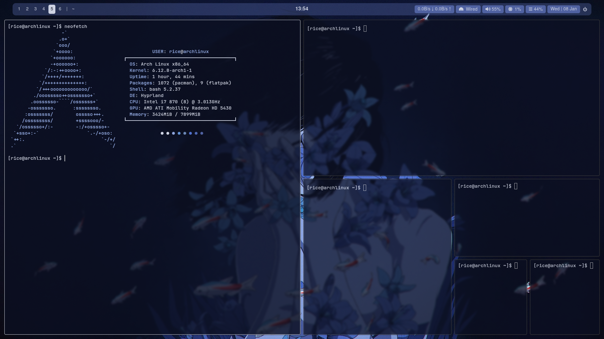

# Dotfiles

**Dotfiles** is a collection of configuration files aimed at setting up a personalized and efficient Linux environment. This repository includes configurations for various tools and applications, enhancing productivity and aesthetics.

## Depenencies
- brightnessctl (to adjust the brightness)
- wpctl (to adjust the volume)
- grim (for screenshot tool)
- cava (for audio visualizer tool)

## Hyprland Arch Environment

## Another Waybar

