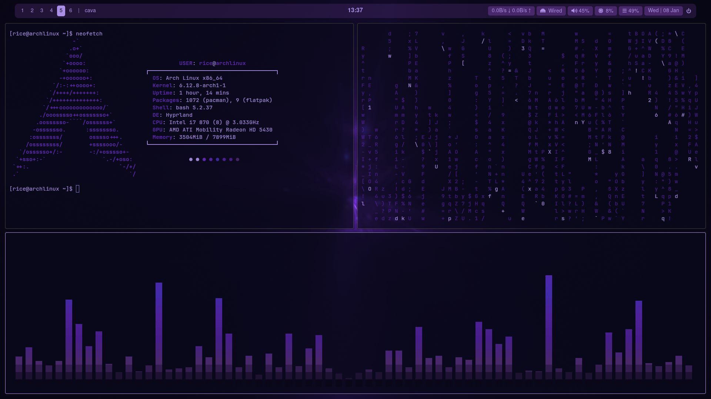

# Dotfiles

**Dotfiles** is a collection of configuration files aimed at setting up a personalized and efficient Linux environment. This repository includes configurations for various tools and applications, enhancing productivity and aesthetics.

## Depenencies
- hyprpaper (for wallpaper)
- waybar (for top bar)
- wofi (for launcher)
- wlogout (for logout menu)
- cava (for audio visualizer tool)
- grim (for screenshot tool)
- brightnessctl (to adjust the brightness)
- wpctl (to adjust the volume)
- "otf-font-awesome" and "ttf-jetbrains-mono-nerd" is required to be installed for waybar icons

## Installation

### Auto Installation

> [!Warning]
> The installation script includes a function that backs up your existing dotfiles. However, in the unlikely event that something goes wrong with the
> backup process, your current files might not be safely backed up. To avoid potential data loss, it is highly recommended to manually back up your
> dotfiles before running the installation script.

    cd ~/Downloads
    git clone https://github.com/ekinutkuu/dotfiles-hyprland
    cd dotfiles-hyprland/
    sudo chmod +x ./install.sh
    ./install.sh

### Manuel Installation

> [!IMPORTANT]
> Don't forget to install dependencies!

**1. Clone The Repository:**

    cd ~/Downloads
    git clone https://github.com/ekinutkuu/dotfiles-hyprland
    cd dotfiles-hyprland/

**2. Backup Existing Dotfiles:**

    mkdir -p ~/.config/.backup
    cp -r ~/.config/* ~/.config/.backup/

**3. Copy New Dotfiles:**

    cp -r cava/ ~/.config/
    cp -r hypr/ ~/.config/
    cp -r kitty/ ~/.config/
    cp -r neofetch/ ~/.config/
    cp -r waybar/ ~/.config/
    cp -r wlogout/ ~/.config/
    cp -r wofi/ ~/.config/

## Wallpaper and Theme Change Script

> [!Caution]
> Your old colors will not be backed up. Please back up your config directory if you do not want to lose your current color settings.

**Usage:**

    sudo chmod +x change_wallpaper.sh
    ./change_wallpaper.sh /path/of/your/wallpaper

When you run this script, it will change your wallpaper to the one specified in the command. Then, you'll be asked if you'd like to update the colors of various components such as **Kitty**, **Waybar**, **Hyprland** and many more... The colors of the these components will change according to the color scheme of your selected wallpaper.

## Keybindings

| Keys                                                                                  | Action                                                   |
| :------------------------------------------------------------------------------------ | :------------------------------------------------------- |
| <kbd>Super</kbd> + <kbd>T</kbd>                                                       | Open a terminal                                          |
| <kbd>Super</kbd> + <kbd>Q</kbd>                                                       | Close active window                                      |
| <kbd>Alt</kbd> + <kbd>Space</kbd>                                                     | Open apps menu                                           |
| <kbd>Super</kbd> + <kbd>E</kbd>                                                       | Open file manager                                        |
| <kbd>Super</kbd> + <kbd>T</kbd>                                                       | Open firefox                                             |
| <kbd>Prtsc</kbd>                                                                      | Take screenshot                                          |
| <kbd>Super</kbd> + <kbd>Arrow Keys</kbd>                                              | Change focus between windows in the specified direction  |
| <kbd>Super</kbd> + <kbd>Shift</kbd> + <kbd>Arrow Keys</kbd>                           | Move active window to a different position               |
| <kbd>Super</kbd> + <kbd>Ctrl</kbd> + <kbd>Arrow Keys</kbd>                            | Resize active window                                     |
| <kbd>Super</kbd> + <kbd>V</kbd>                                                       | Toggle floating mode                                     |
| <kbd>Super</kbd> + <kbd>1</kbd> or <kbd>2</kbd> or <kbd>3</kbd> ...                   | Switch directly to specific workspace                    |
| <kbd>Super</kbd> + <kbd>Alt</kbd> + <kbd>Left and Right Arrow Keys</kbd>              | Move between workspaces one by one                       |
| <kbd>Super</kbd> + <kbd>Alt</kbd> + <kbd>1</kbd> or <kbd>2</kbd> or <kbd>3</kbd> ...  | Move active window to a workspace                        |
| <kbd>Super</kbd> + <kbd>Shift</kbd> + <kbd>L</kbd>                                    | Open a session menu (shut down, reboot, logout...)       |
| <kbd>Super</kbd> + <kbd>M</kbd>                                                       | Exit Hyprland                                            |

## I USE ARCH (BTW)

